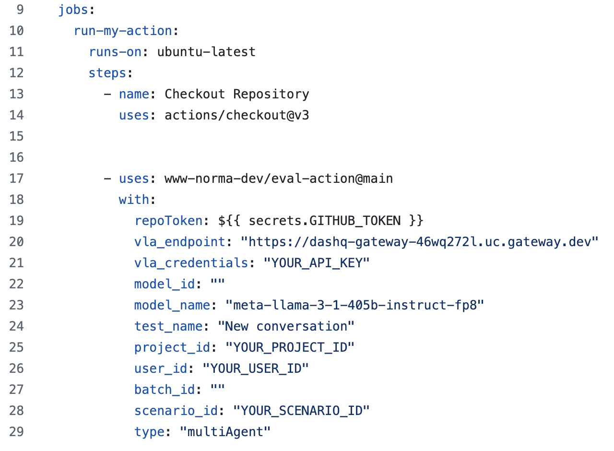

# GitHub Action – API Evaluation Reporter

This GitHub Action triggers on pull requests, sends an evaluation request to a specified API, and posts the results as a comment on the PR.

It helps teams automatically test API endpoints and visualize evaluation results directly in GitHub.

## How it works

1. Triggered by a `pull_request` event.
2. Sends a POST request to an evaluation API with provided test metadata.
3. Retrieve response data to request batch results API.
3. Formats the response into a markdown table.
4. Creates or updates a comment in the pull request with the results.

## File overview

- index.js: orchestrates API calls
- post.js: sends a request to evaluation API with a POST method, then creates or updates the PR comment.
- get.js: sends a request to fetch evaluation results API with a GET method, then creates or updates another PR comment.
- utils.js: contains a function for formatting data into a table with scores and color indicator.
- action.yml: specifies the inputs required by eval-action and makes them available when the action is invoked in a GitHub Actions workflow.

## How to call eval-action



## Build

Before committing, build the action using:

```bash
npx ncc build src/index.ts -o dist
